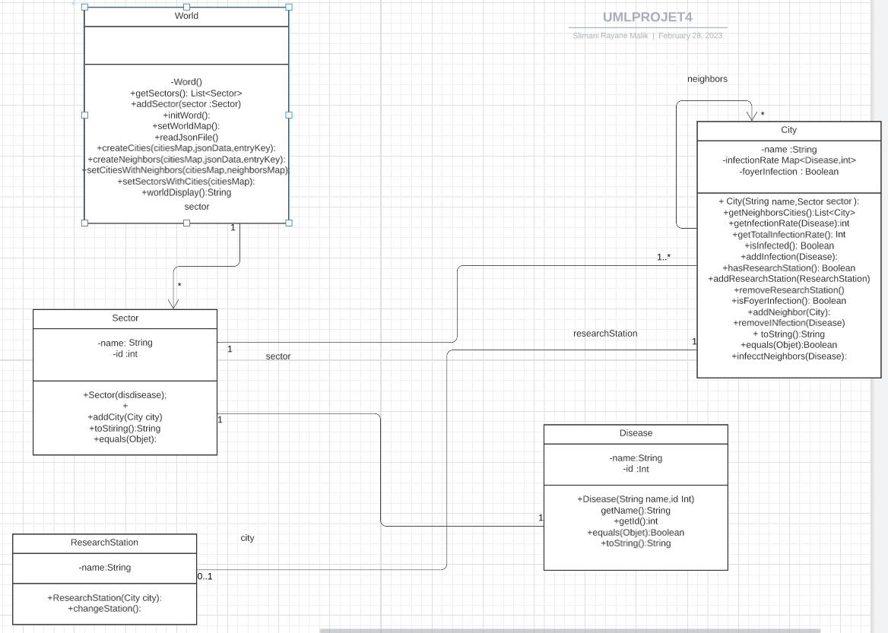
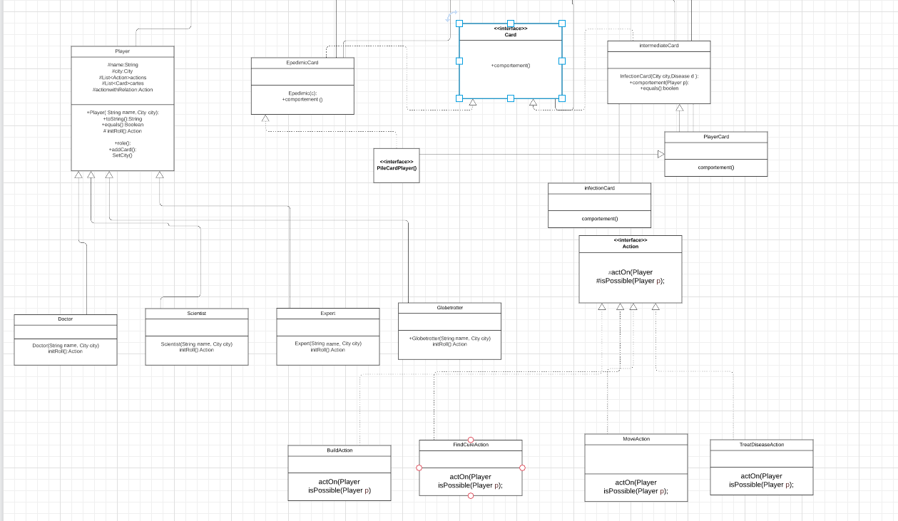

# l2s4-projet-2023

# Equipe

- Rayane Malik Slimani
- Yanis Gherdane 
- Manil Diaf
- Anes Seghir 

# Sujet

[Le sujet 2023]
# Lien Uml : 

#### UML LIVRET1:

# Journal de bord

## Semaine 1
 En premier lieu, On a commencé a lire l'énoncé du sujet. Puis on a entamé a l'analyser. Ensuite on a définie les classes et on a commencé a faire l'UML du projet classe par classe d'en suivant l'énoncé du sujet. 

## Semaine 2
On a commencé a faire quelques classes. Certaines d'entre elles,on les définie pour se mettre en place afin de bien structurer le projet. D'autres, on les à entamé d'une manière ou chaqu'un des membre du notre groupe propose et réalise sous l'accord des autres memebres certaines méthodes.
On modifie l'UML en cours de l'avancement.
## Semaine 3
Après la révision avec la prof chargée de notre TP a propos de l'UML, et après avoir eu sa confirmation, on a changé certaines classes et leurs méthodes, on à également ajouté nos propres méthodes pour personnaliser le projet en incluant le fichier Json.

## Semaine 4
Dans cette semaine, on a entamé les tests de chaque classe et on les a amélioré suivant les méthodes ajoutés puis on a fait une révision de certaines classes en améliorant grace au coup de main de notre enseignante.

## Semaine 5
Lors de cette semaine, on a fait quelques modifications et on a ajouté des tests pour chaque classe.

## Semaine 6
Relecture de la partie du livrable 2 dans le sujet sur tout ce qui conserne les joueurs et les differentes cartes, et début de la modalisation de l'UML.

## Semaine 7
Répartition des taches et debut du code après finition de l'UML.

## Semaine 8
Changement de la modélisation de l'UML après avoir eu une nouvelle modélisation. 
## Semaine 9
Début, changement du code et correction des erreurs du livrable 1 en seance .
## Semaine 10
Pause (examens).
## Semaine 11
Creation de la class Player (class abstract) et mise en place des actions dans un package a part, pour eviter toute confusion, en cas d'ajout d'extentions dans le jeux (nouvelle action)
Creation des classes Cards par Yanis et Anes en suivant l'UML vue par l'enseignante (Card comme Interface).
## Semaine 12
Suite à une confusion et une mauvaise interprétation de notre part suite que la prof valide notre UML ( card comme interface ) les membres Yanis et Anes qui ont comme tache de réaliser les classes Card, PlayerCard, EpidémicCard, InfectionCard, se fient au consignes de l'UML faux et se trompent dans la réalisation de leurs Classes.
Erreurs lors de la réalisation du main final et réalisation de l'erreur de l'UML (partie Cards). Ainsi obligation de changer la classe Card qui était une Interface pour une classe Abstract. 